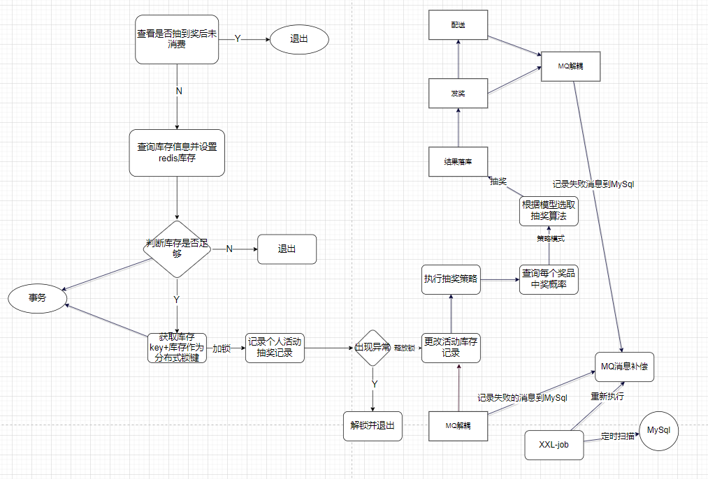
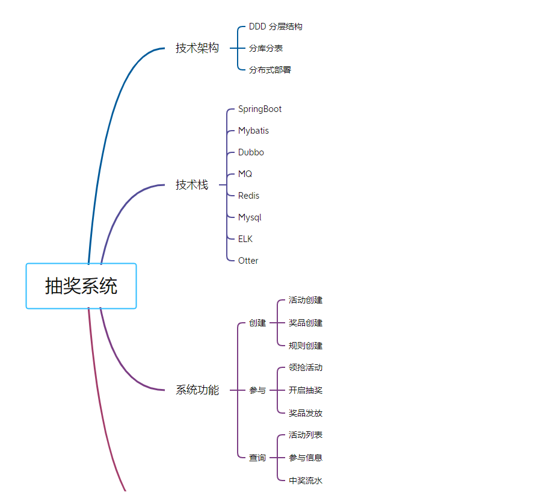
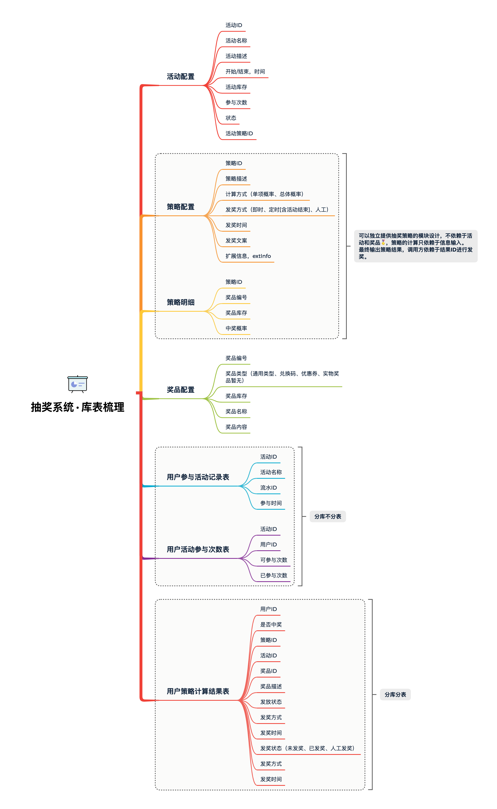
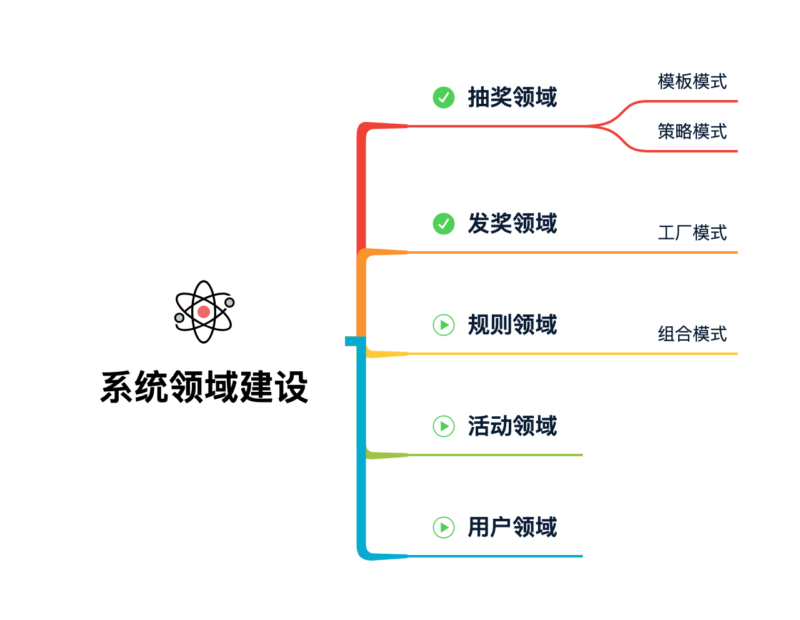
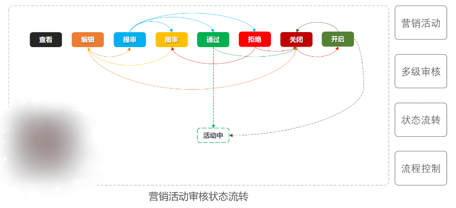
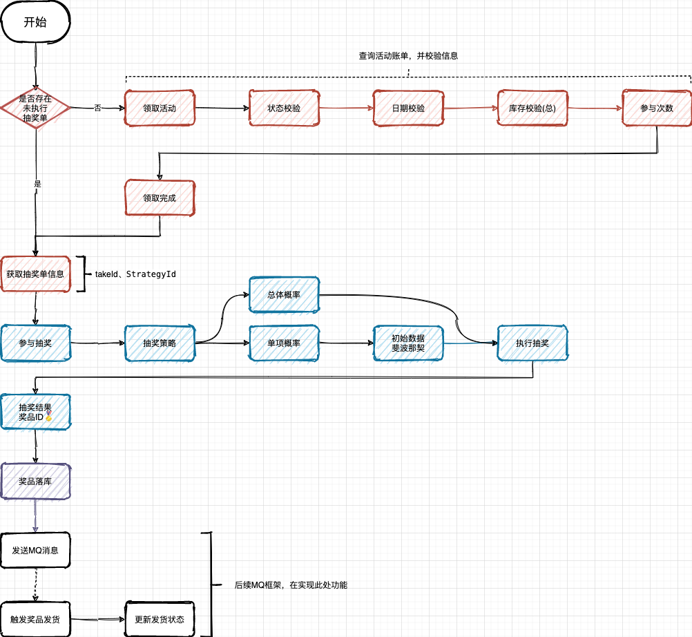
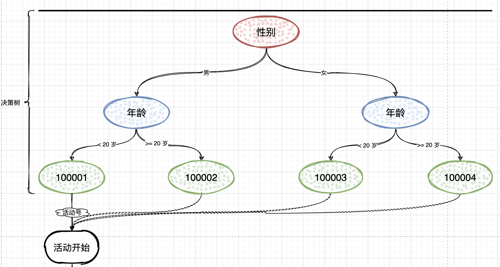
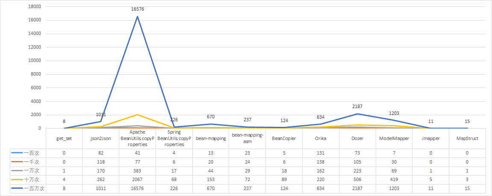
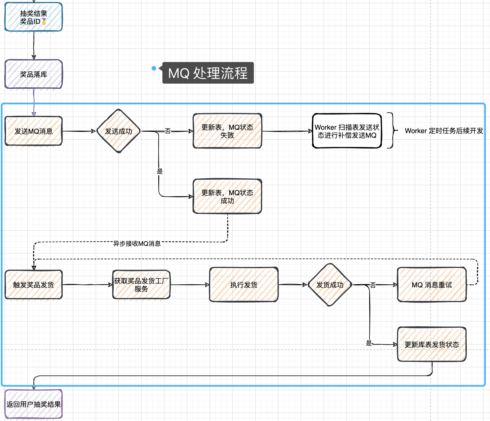

# PDD抽奖

## 抽奖流程

## 基础架构


### DDD分层架构
项目结构


#### 应用层Application

应用服务位于应用层。用来表述应用和用户行为，负责服务的组合、编排和转发，负责处理业务用例的执行顺序以及结果的拼装。
**应用层的服务包括应用服务和领域事件相关服务。**
**应用服务可对微服务内的领域服务以及微服务外的应用服务进行组合和编排，或者对基础层如文件、缓存等数据直接操作形成应用服务，对外提供粗粒度的服务。**
领域事件服务包括两类：领域事件的发布和订阅。通过事件总线和消息队列实现异步数据传输，实现微服务之间的解耦。

#### Domain层

领域服务位于领域层，为完成领域中跨实体或值对象的操作转换而封装的服务，领域服务以与实体和值对象相同的方式参与实施过程。
**领域服务对同一个实体的一个或多个方法进行组合和封装，或对多个不同实体的操作进行组合或编排，对外暴露成领域服务。领域服务封装了核心的业务逻辑。实体自身的行为在实体类内部实现，向上封装成领域服务暴露。**
**为隐藏领域层的业务逻辑实现，所有领域方法和服务等均须通过领域服务对外暴露。**
为实现微服务内聚合之间的解耦，原则上禁止跨聚合的领域服务调用和跨聚合的数据相互关联。

#### Infrastructure层

基础服务位于基础层。为各层提供资源服务（如数据库、缓存等），实现各层的解耦，降低外部资源变化对业务逻辑的影响。

基础服务主要为仓储服务，通过依赖反转的方式为各层提供基础资源服务，领域服务和应用服务调用仓储服务接口，利用仓储实现持久化数据对象或直接访问基础资源。

一般对应一些数据库的实体类都放到这里，还有一些dao的都放到这一层进行处理

#### Interface层

接口服务位于用户接口层，用于处理用户发送的**Restful**请求和解析用户输入的配置文件等，并将信息传递给应用层。

### RPC

对外提供接口描述信息

一般将接口都写在这里面，然后在interface中进行实现，然后在应用层application进行dubboReference进行rpc的调用。这样就完成了一部分的调用工作。

#### Dubbo的配置

一般都是配置zookeeper为注册中心

```yaml
dubbo:
  registry:
    address: zookeeper://ip:2181  #注册中心
  application:
    name: Lottery
    version: 1.0
  protocol:  #使用的协议，默认是使用dubbo进行的，是rpc，处于osi7层模型中的第五层。也可以rmi远程调用，或者http等方式进行调用
    name: dubbo
    port: 20881
  scan:
    base-packages: com.kevin.lottery.rpc  #接口扫描
```

`dubbo的调用过程`


### 活动表设计

因为是一个抽奖系统，首先涉及到活动

因此需要一个活动表

对应的字段应该有：主键id、活动名称、活动id(多张表联合，对应具体的活动细节)、活动开始时间、活动结束时间、活动描述、活动可以参加人数、库存、活动状态(1编辑、2提审、3撤审、4通过、5运行(审核通过后worker扫描状态)、6拒绝、7关闭、8开启)、创建时间、更新时间、创建人、更新人


对应的建表语句如下：

```sql
create table `activity`(
	id bigint(20) not null AUTO_INCREMENT comment '自增id',
	activity_id bigint(20) not null comment '活动id',
	activity_name varchar(64) CHARACTER set utf8mb4 DEFAULT null comment '活动名称',
	activity_desc varchar(128) CHARACTER set utf8mb4 DEFAULT null comment '活动描述',
	begin_date_time datetime DEFAULT null COMMENT '活动开始时间',
	end_date_time datetime DEFAULT null comment '活动结束时间',
	stock_count int(11) DEFAULT null comment '库存',
	take_count int(11) DEFAULT null comment '每次活动可以参加人数',
	state TINYINT(2) DEFAULT null comment '活动状态：1编辑、2提审、3撤审、4通过、5运行(审核通过后worker扫描状态)、6拒绝、7关闭、8开启',
	create_time datetime DEFAULT CURRENT_TIMESTAMP comment '创建时间',
	update_time datetime DEFAULT CURRENT_TIMESTAMP comment '更新时间',
	creator varchar(64) CHARACTER set utf8mb4 comment '创建人',
	PRIMARY KEY(`id`),
	unique key `unique_activity_id`(`activity_id`)
)ENGINE = INNODB auto_increment=2 DEFAULT charset=utf8mb4 collate=utf8mb4_bin comment ='活动配置';
```

这里的utf8mb4_bin 是一种区分大小写和二进制比较的utf-8编码字符集。

#### 对应的具体表


因为涉及到活动，活动的进行规则、策略，奖品的发放，以及奖品发放等信息，以及用户、用户参与信息等表。

#### 使用策略模式解决算法调用问题
这里有一个抽奖算法，一个是单例随机算法，另一个是全局随机算法
单例不用重新计算概率，全局需要重新计算对应的概率问题

所以这里使用一个枚举类执行对应的获取实现类，然后执行对应的概率方法，完成抽奖概率分配。
同时使用斐波那锲进行概率分布

#### 模板模式的使用
模板模式主要为了解决对一些通用方法的封装，以及对一些类进行对应的分工明确操作。
这里对一般常用的初始化方式进行了封装，设置成为config的默认方法，然后对于执行抽奖方法也进行了对应的默认实现。

但是对于一些模式排除，算法具体详情、结果排除等需要根据业务来执行的方法，进行对应的按照业务类进行实现。

## 设计模式的使用


### 状态模式解决流程问题
基础流程：

通过模板模式解决通用的流程方法，并且配合IStateHandler进行状态处理接口的方法
进行实现每一个状态对应的方法，其中对于每一个状态，都单独定义一个类出来进行对应的实现，包括继承了基础类，和实现了对应的刘恒处理方法。
并配合策略模式，将对应的类按照对应的枚举类型注入到一个map中，调用的时候需要找到对应的状态类型，然后执行他对应的状态方法就行了。
其中这些状态类的状态方法是根据自己处于 转台进行对应的调整的

#### 分布式id生成

这里使用了一个策略模式进行id的生成，根据对应的业务选择对应的id生成策略。

有雪花算法、短时间id+随机数生成，时间+ip生成等。

如下：

编写一个id生成接口

```java
public interface IIDGenerate {

    /**
     *获取ID，目前有两种实现方式 1. 雪花算法，用于生成单号
     * 2. 日期算法，用于生成活动编号类，特性是生成数字串较短，但指定时间内不能生成太多
     * 3. 随机算法，用于生成策略ID
     * @return 返回根据策略生成的id
     */
    Long nextId();
}
```

并进行对应的类别实现

雪花id

```java
@Component
public class SnowFlake implements IIDGenerate {
    private Snowflake snowFlake;

    @PostConstruct
    public void init(){
        long workId;

        try {
            workId = NetUtil.ipv4ToLong(NetUtil.getLocalhostStr());
        } catch (Exception e) {
            workId = NetUtil.getLocalhost().hashCode();
        }
        workId = workId >>16 &31;
        long dateCenterId = 1l;
        snowFlake = IdUtil.createSnowflake(workId,dateCenterId);
    }
    @Override
    public Long nextId(){
        return snowFlake.nextId();
    }
}
```

短id

```java
@Component
public class ShortCode implements IIDGenerate {

    @Override
    public Long nextId() {
        Calendar calendar = Calendar.getInstance();

        int year = calendar.get(Calendar.YEAR);
        int week = calendar.get(Calendar.WEEK_OF_YEAR);
        int day = calendar.get(Calendar.DAY_OF_MONTH);
        int hour = calendar.get(Calendar.HOUR_OF_DAY);

        StringBuilder sb = new StringBuilder();

        sb.append(year-2020).append(hour).append(String.format("%02d",week)).append(day).append(String.format("%03d",new Random().nextInt(1000)));

        return Long.parseLong(sb.toString());
    }
}

```

随机id

```java
@Component
public class RandomNumeric implements IIDGenerate {

    @Override
    public Long nextId() {
        return Long.parseLong(RandomStringUtils.randomNumeric(11));
    }
}
```

然后重新整合一个策略模式的总体组，将这些id生成类型的接口一一根据对应的类型放入进去，调用的时候传入对应的类型即可调用对应的id生成算法

```java
@Component
public class IDContext {

    /**
     * 创建 ID 生成策略对象，属于策略设计模式的使用方式
     * Params:
     * snowFlake – 雪花算法，长码，大量 shortCode – 日期算法，短码，少量，全局唯一需要自己保证 randomNumeric – 随机算法，短码，大量，全局唯一需要自己保证
     * Returns:
     * IIdGenerator 实现类
     * @param randomNumeric
     * @param shortCode
     * @param snowFlake
     * @return
     */
    @Bean
    public Map<Constance.Ids, IIDGenerate> idGenerateMap(RandomNumeric randomNumeric, ShortCode shortCode, SnowFlake snowFlake){
        Map<Constance.Ids,IIDGenerate> map = new HashMap<>(8);
        map.put(Constance.Ids.RandomNumeric,randomNumeric);
        map.put(Constance.Ids.ShortCode,shortCode);
        map.put(Constance.Ids.SnowFlake,snowFlake);
        return map;
    }
}
```
### 整个抽奖流程的逻辑


这里使用了一个MQ来处理解耦，同时进行异步处理，让他这个流程处理下来不会因为抽奖的某一个步骤卡主，整个接口就卡住
，对他进行异步处理，暂时解耦，先把接口返回回去，然后在对一些异步步骤使用消息来进行处理，这样既能够保证整个接口的响应速度和解耦

### 使用流程对抽奖人进行筛选
根据对应的条件，对参与抽奖的人提供条件，满足条件的人才能够进行抽奖。
这里使用了一个类似引擎的处理流程来处理抽奖过滤，类似树的结构
其中需要建三张表
一张表是对应的根节点，也就是树节点
对应如下
```sql
CREATE TABLE `rule_tree` (
  `id` bigint NOT NULL AUTO_INCREMENT COMMENT '主键ID',
  `tree_name` varchar(64) DEFAULT NULL COMMENT '规则树Id',
  `tree_desc` varchar(128) DEFAULT NULL COMMENT '规则树描述',
  `tree_root_node_id` bigint DEFAULT NULL COMMENT '规则树根ID',
  `create_time` datetime DEFAULT NULL COMMENT '创建时间',
  `update_time` datetime DEFAULT NULL COMMENT '更新时间',
  PRIMARY KEY (`id`)
) ENGINE=InnoDB AUTO_INCREMENT=2110081903 DEFAULT CHARSET=utf8mb3;
```

下一张表是对应的树结构，只是单纯的树结构，以及存储对应的用于过滤的key
```sql
CREATE TABLE `rule_tree_node` (
  `id` bigint NOT NULL AUTO_INCREMENT COMMENT '主键ID',
  `tree_id` int DEFAULT NULL COMMENT '规则树ID',
  `node_type` int DEFAULT NULL COMMENT '节点类型；1子叶、2果实',
  `node_value` varchar(32) DEFAULT NULL COMMENT '节点值[nodeType=2]；果实值',
  `rule_key` varchar(16) DEFAULT NULL COMMENT '规则Key',
  `rule_desc` varchar(32) DEFAULT NULL COMMENT '规则描述',
  PRIMARY KEY (`id`)
) ENGINE=InnoDB AUTO_INCREMENT=123 DEFAULT CHARSET=utf8mb3;
```
最后一张表承接上面第二张表，存储他的对应的值和用于判断的大小类型，是大于还是小于等。
```sql
   CREATE TABLE `rule_tree_node_line` (
                                         `id` bigint NOT NULL AUTO_INCREMENT COMMENT '主键ID',
                                         `tree_id` bigint DEFAULT NULL COMMENT '规则树ID',
                                         `node_id_from` bigint DEFAULT NULL COMMENT '节点From',
                                         `node_id_to` bigint DEFAULT NULL COMMENT '节点To',
                                         `rule_limit_type` int DEFAULT NULL COMMENT '限定类型；1:=;2:>;3:<;4:>=;5<=;6:enum[枚举范围];7:果实',
                                         `rule_limit_value` varchar(32) DEFAULT NULL COMMENT '限定值',
                                         PRIMARY KEY (`id`)
   ) ENGINE=InnoDB AUTO_INCREMENT=7 DEFAULT CHARSET=utf8mb3;
```
#### 具体的流程是这样的
首先根据对应的treeId，查出对应的树节点，也就是跟节点，然后在根据根节点的规则树id，叶就是属于他的子节点id，把全部的
子节点都查询出来，封装太一个List里面，然后在根据这个list进行遍历查询他对应的判断类型，判断值，也就是第三张表。
然后可以封装成为一个map，key是他对应的节点的id，value是他这个节点对应用于判断的值和判断的类型。
因为他这些节点的有一个id_to字段，所以可以找到他最后面的一个节点，最后面的节点把他设置成为果实节点，也就是存放对应的活动id的地方，
通过不断的往下遍历，并且在遍历的过程中不断判断对应的类型和类型值进行对应的在过滤，最终找到的果实节点，他的`node_value`就是对应的活动的id
这样就能够在对一些人群进行匹配抽奖条件。完成过滤。
对应的结构树如下

获取到最后的节点的活动id就可以进行对应的抽奖操作了。

#### 对象转化
对象转化性能情况

对于使用Spring的beanUtils.copyProtyties()方法效率也不算太低，但是也不高
但是如果单纯使用get和set的方式，容易出错，所以这里使用了一个mapstruct
需要导入的依赖：
```xml
<!-- https://mvnrepository.com/artifact/org.mapstruct/mapstruct -->
        <dependency>
            <groupId>org.mapstruct</groupId>
            <artifactId>mapstruct</artifactId>
            <version>1.5.3.Final</version>
        </dependency>

        <!-- https://mvnrepository.com/artifact/org.mapstruct/mapstruct-processor -->
        <dependency>
            <groupId>org.mapstruct</groupId>
            <artifactId>mapstruct-processor</artifactId>
            <version>1.5.3.Final</version>
        </dependency>
```
具体的配置类：
```java
@MapperConfig
public interface IMapping<SOURCE,TARGET> {
    /**
     * 映射同属性名称，正向
     * @param var1
     * @return
     */
    @Mapping(target = "createTime",dateFormat = "yyyy-MM-dd HH:mm:ss")
    TARGET sourceToTarget(SOURCE var1);

    /**
     * 映射同属性名称，反向
     * @param var1
     * @return
     */
    @InheritInverseConfiguration(name = "sourceToTarget")
    SOURCE targetToSource(TARGET var1);

    /**
     * 映射同属性集合，正向
     * @param var1
     * @return
     */
    @InheritConfiguration(name = "sourceToTarget")
    List<TARGET> sourceToTarget(List<SOURCE> var1);

    /**
     * 映射同属性集合，反向
     * @param var1
     * @return
     */
    @InheritConfiguration(name = "targetToSource")
    List<SOURCE> targetToSource(List<TARGET> var1);

    /**
     * 映射流，正向
     * @param stream
     * @return
     */
    List<TARGET> sourceToTarget(Stream<SOURCE> stream);

    /**
     * 映射流，反向
     * @param stream
     * @return
     */
    List<SOURCE> targetToSource(Stream<TARGET> stream);
}

```
这个是在编译的时候就进行性生成的代码，而不是在运行的时候通过字节码进行解析，然后反射生成，反射设置值，所以效率方面较高
下面这个是他反射以后经过反编译的代码
```java
package com.kevin.lottery.assembler;

import com.kevin.domain.strategy.model.vo.DrawAwardVO;
import com.kevin.lottery.rpc.dto.AwardDto;
import java.util.ArrayList;
import java.util.List;
import java.util.stream.Collectors;
import java.util.stream.Stream;
import javax.annotation.Generated;
import org.springframework.stereotype.Component;

@Generated(
    value = "org.mapstruct.ap.MappingProcessor",
    date = "2023-11-09T15:15:46+0800",
    comments = "version: 1.5.3.Final, compiler: javac, environment: Java 1.8.0_333 (Oracle Corporation)"
)
@Component
public class AwardMappingImpl implements AwardMapping {

    @Override
    public List<AwardDto> sourceToTarget(List<DrawAwardVO> var1) {
        if ( var1 == null ) {
            return null;
        }

        List<AwardDto> list = new ArrayList<AwardDto>( var1.size() );
        for ( DrawAwardVO drawAwardVO : var1 ) {
            list.add( sourceToTarget( drawAwardVO ) );
        }

        return list;
    }

    @Override
    public List<DrawAwardVO> targetToSource(List<AwardDto> var1) {
        if ( var1 == null ) {
            return null;
        }

        List<DrawAwardVO> list = new ArrayList<DrawAwardVO>( var1.size() );
        for ( AwardDto awardDto : var1 ) {
            list.add( targetToSource( awardDto ) );
        }

        return list;
    }

    @Override
    public List<AwardDto> sourceToTarget(Stream<DrawAwardVO> stream) {
        if ( stream == null ) {
            return null;
        }

        return stream.map( drawAwardVO -> sourceToTarget( drawAwardVO ) )
        .collect( Collectors.toCollection( ArrayList<AwardDto>::new ) );
    }

    @Override
    public List<DrawAwardVO> targetToSource(Stream<AwardDto> stream) {
        if ( stream == null ) {
            return null;
        }

        return stream.map( awardDto -> targetToSource( awardDto ) )
        .collect( Collectors.toCollection( ArrayList<DrawAwardVO>::new ) );
    }

    @Override
    public AwardDto sourceToTarget(DrawAwardVO var1) {
        if ( var1 == null ) {
            return null;
        }

        AwardDto awardDto = new AwardDto();

        awardDto.setUserId( var1.getuId() );
        awardDto.setAwardId( var1.getAwardId() );
        awardDto.setAwardType( var1.getAwardType() );
        awardDto.setAwardName( var1.getAwardName() );
        awardDto.setAwardContent( var1.getAwardContent() );
        awardDto.setStrategyMode( var1.getStrategyMode() );
        awardDto.setGrantType( var1.getGrantType() );
        awardDto.setGrantDate( var1.getGrantDate() );

        return awardDto;
    }

    @Override
    public DrawAwardVO targetToSource(AwardDto var1) {
        if ( var1 == null ) {
            return null;
        }

        DrawAwardVO drawAwardVO = new DrawAwardVO();

        drawAwardVO.setAwardId( var1.getAwardId() );
        drawAwardVO.setAwardName( var1.getAwardName() );
        drawAwardVO.setAwardContent( var1.getAwardContent() );
        drawAwardVO.setAwardType( var1.getAwardType() );
        drawAwardVO.setStrategyMode( var1.getStrategyMode() );
        drawAwardVO.setGrantType( var1.getGrantType() );
        drawAwardVO.setGrantDate( var1.getGrantDate() );

        return drawAwardVO;
    }
}

```
实现类配置
```java
@Mapper(componentModel = "spring",unmappedSourcePolicy = ReportingPolicy.IGNORE,unmappedTargetPolicy = ReportingPolicy.IGNORE)
public interface AwardMapping  extends IMapping<DrawAwardVO, AwardDto> {

    @Mapping(source = "uId",target = "userId")
    @Override
    AwardDto sourceToTarget(DrawAwardVO var1);

    @Override
    DrawAwardVO targetToSource(AwardDto var1);
}
```
反编译生成的代码就是上面那种情况。


#### 引入mq之后的执行流程

引入mq在进行流程解耦的同时，能够相当于异步的方式去处理一些不是很接口直接相关的操作，加快接口的响应速度。
## 待解决的问题
1. mapper和对应的xml没有映射到的问题
   2. 这个你需要注意查看你使用的是mybatis还是mybatis-plus，如果你使用的是plus，应该是配置专属于plus的，而不是mybatis，否则他映射不到，具体看你使用的是plus的stater还是mybatis的stater
2. mybatis-plus写代码，多了以后，会不会变得混乱，是否直接使用mapper层进行执行对应的方法会更好呢？

## 记录的错误
1. kafka在配置的时候使用：listeners=PLAINTEXT://10.127.96.151:9092
这后面的端口号尽量写真实的端口号，而不是使用127.0.0.1或者localhost
2. xxl-job使用的时候出现的问题，他是通过发送对应的执行信息给执行器，这个执行器是必须有地址的，所以他们两个必须是可以连通的，比如两个都是公网ip，否则的话你在本地执行的话，你在服务器上部署的xxl-job是访问不到本地的，也就不能给本地的对应任务进行执行操作了。这个时候你可以使用内网穿透技术，让公网的ip和你对应的本地进行联通，这样就可以调用对应的服务了。


### 使用过程中出现的错误
#### 使用kafka的时候出现的问题和解决方法
Commit cannot be completed since the group has already rebalanced and assigned the partitions to another member. This means that the time between subsequent calls to poll() was longer than the configured max.poll.interval.ms, which typically implies that the poll loop is spending too much time message processing. You can address this either by increasing max.poll.interval.ms or by reducing the maximum size of batches returned in poll() with max.poll.records.
 
**出现的原因**：这个组已经移交给另一个成员了，因此无法提交完成，然后之后连续调用的poll之间的时间比配置的最大时间长，所以就会出现这种现象
**解决办法**：按照上面的提示，将这两个参数设置大一点max.poll.interval.ms和max.poll.records

#### 消息重复的原因
